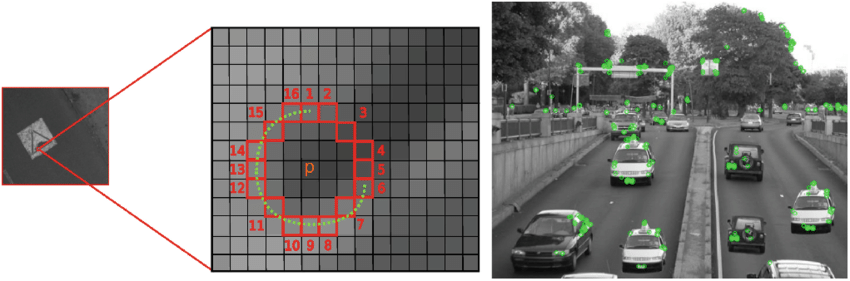
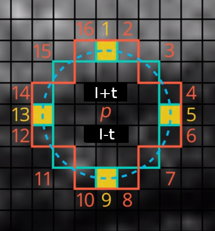
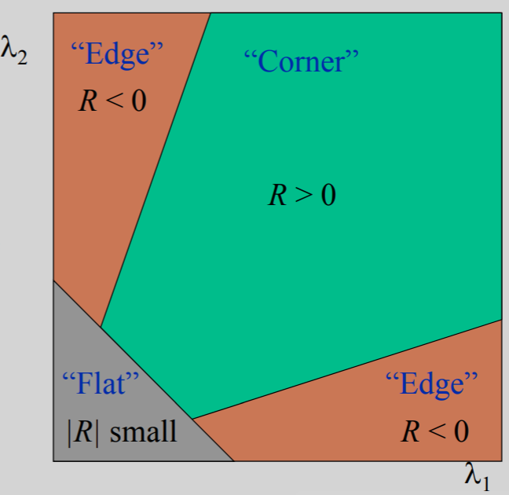

# Homework - ORB detector
  
This homework will guide you through the implementation of part of the **ORB** (Oriented FAST and Rotated BRIEF) pipeline. The ORB consists of the feature detector and feature descriptor that detect and describe reproducible and discriminative regions in an image. Those, in turn, can be matched between pairs of images for correspondence search, 3D reconstruction and so on.
  

  
Follow to `hw_numpy_orb.ipynb` to see how the ORB pipeline can be used for the correspondence matching. In this homework, we will focus only on the implementation of keypoints detector.
  
In the ORB pipeline, the keypoints detector is an improved version of the **FAST** detector. FAST keyponts detector is based on an extremely simple idea. In FAST, each pixel of an image is compared with other pixels at a Bresenham circle taken around it. Usually, a circle of radius 3 is used, meaning comparing each pixel with 16 others, as shown in the image below (***left***). If the center pixel is either darker than $N$ its neighbours or lighter than $N$ its neighbours, it is considered an interest point and is added to the list of initial keypoints. A threshold $t$ is used for additional robustness, i.e. a center pixel should be either darkner than $I_i - t$ or lighter than $I_i + t$ (for $i\in\{1,16\}$ where $I_i$ is the intensity of $i$-th point on the Bresenham circle).
  
  

 
<i><b>Left</b>: rotated FAST keypoints detector. <b>Right</b>: oriented BRIEF keypoints descriptor.</i>

  
1) We will start by implementing the basic version of FAST keypoints detector. You will find the implementation template in `orb.py`. Implement `detect_keypoints()` function. You will find helper testing code in `hw_numpy_orb.ipynb`, and some testing images in `img` folder. Feel free to write additional code or download additional images to test your implementation.

To speed up the keypoint detection, FAST performs intensity checks in two steps: first, it compares the center pixels only to circle pixels at positions 1, 5, 9 and 13 (`FAST_FIRST_TEST_INDICES`). Then, if at least 3 (`FAST_FIRST_TEST_THRESHOLD`) circle pixels pass the intensity check, perform the check on all the pixels in the circle. At least 12 (`FAST_SECOND_TEST_THRESHOLD`) should now pass the test. Use `FAST_ROW_OFFSETS` and `FAST_COL_OFFSETS` to easily compute the coordinates of the circle pixels for each tested pixel.
  
*Hint: do not test pixels whose index are closer than `FAST_CIRCLE_RADIUS` to the image border.*
  

 
<i>In first step, test the center pixel only against pixels 1, 5, 9 and 13, marked in yellow color. Then, if the first test passes, test the center pixel against all 16 pixels on the circle.</i>

  
Following the OpenCV's implementation, for each keypoint, we also compute a score as a *maximum of minimum abs-differences* between the center pixels and all consecutive groups of 9 pixels on the Bresenham circle. For this, implement `calculate_kp_scores()` and call it in `detect_keypoints()` to get score for all points in initial FAST keypoints list (i.e. to `keypoints` variable).
  

 
<i><b>Left</b>: example image. <b>Right</b>: taking 9 consecutive pixels on a circle for the min abs-difference computation.</i>

  
For each added keypoint, compare it to all groups of 9 consecutive pixels on the circle (you will have 16 groups like this, each starting from a different pixel on the circle). Calculate the minimum of the absolute differences between the center keypoints and those 9 pixels. Report the final keypoint score as maximum of those minimums from all the 16 groups.
  
*Hint: `np.roll()` In case you use `np.roll` for 2d shifts better use argument `axis=(0,1)`.*
  
  

 
<i>Example of three groups of 9 consecutive pixels. You have to take all 16 such groups and, for each group, calculate the minimum of the absolute differences. The final score is the maximum of those minimums.</i>

  
2) In ORB, this FAST keypoint detection is performed in multiple levels of an image pyramid so that multi-scale keypoints are properly detected. Implement `create_pyramid()` function, which takes an image `img` and downscales it by `downscale_factor`  `n_pyr_layer` times. On the first level is the original image, then downscaled are following.
  
*Hint: `cv2.resize()`, be carefull, `cv2.resize()`  expects switched X and Y coordinates than numpy. The size of each level should be calculated as float, but rounded up to the closest integer.*
  

  
3) ORB comes with further improvements to the FAST keypoints detector. For example, it is noted that FAST can detect too many edges, which do not provide so good interest points as actual corners. To deal with it, the Harris corner measure is computed for each interest point detected at the previous step. The keypoints from the previous step are then sorted by the resulting corner measure. The top-$N_{max}$ keypoints are kept for each level where $N_{max}$ can be (and, in our implementation, will be) different for each level of the image pyramid.
  

  
Harris corner measure is a simple way to evaluate the "cornerness" of a pixel and is computed as:

$$R = det(A) - k*trace^2(A)$$
  
- [Determinant of a matrix](https://en.wikipedia.org/wiki/Determinant)
- [Trace of a matrix](https://en.wikipedia.org/wiki/Trace_(linear_algebra))
  
  

  
where $k$ is a constant usually equal to 0.05 and $A$ is the second-moment matrix for the given image (also called a structure tensor) which is calculated, for each pixel $p$ as:
  

  
While the equation may seem confusing, the second-moment matrix can be calculated in a several simple steps:s
  
* Implement `get_x_derivative()` and `get_y_derivative()` to compute the x and y derivatives of the input image. The easiest way to do it is by applying the Sobel operator. Same as the Gaussian filter, which we implemented for SIFT, Sobel is a separable filter so that
  

  
*Hint: both these functions can be implemented in two lines each **without** usage of any functions such as `np.convolve`, `scipy.signal.convolve2d` ans so on. Simple mathematical operations with `numpy` are enough (+, - and \*). Also, consider using `.astype(...)` to avoid numerical errors during your calculations and `np.pad()` to keep the original image dimension.*
  
*Hint 2: `scipy.signal.convolve2d` preserves dimension with parameter `mode='same'`, but the values in the first and last row/column differs from these expected here. This rows/columns should be filled by zeros if you use `scipy.signal.convolve2d`.*
  
* Now, implement `get_harris_response()` to compute the Harris response for each pixel. First, compute the weighted elements of the second-moment matrix. To do so, first use `get_x_derivative()` and `get_y_derivative()` to get the first-order derivatives `dx` and `dy`. Then, you want to just get $I_x^2$ (i.e. `dx*dx`), $I_x I_y$ (i.e. `dx*dy`) and $I_y^2$ (i.e. `dy*dy`) at each pixel. Then, for each pixel, the window function is applied and the values in the window are summed with the corresponding weight ($w[r]$ in the formula above). In our implementation, we will use Gaussian window which means just applying the Gaussian 2D smoothing (with $\sigma=1.0$) on all three matrices $I_x^2$, $I_x I_y$ and $I_y^2$. It can be done by `apply_gaussian_2d()` function that is provided to you in `utils.py`. Then, compute the response $R$ from the determinant and trace of the resulting second-moment matrix $A$ as `R = det(A) - 0.05 * (trace(A) ** 2)`.
  
*Hint: Do not use `np.linalg.det()`, you have matrix of shape (2, 2) (for each point of input image), compute it manually for all point at once.
  
* Finally, implement `filter_keypoints()` to sort the previously-computed interest points by their corresponding Harris response. For each level $i$, leave only top-$N_{max_i}$ keypoints.
  
4) ORB pipeline additionally provides the corner orientation computation method, based on the intensity centroid. For each of the Harris-filtered FAST keypoints, a patch is extracted. Its centroid is computed from the moments of a patch as:

$$C = (\frac{m_{10}}{m_{00}}, \frac{m_{01}}{m_{00}})$$

where

$$m_{pq} = \Sigma_{x,y}x^p y^q I(x,y).$$

A vector $OC$ from the patch center $O$ to the centroid location $C$ then defines the patch orientation and can be simply computed as:

$$\theta = atan2(m_{01}, m_{10}).$$
  
5) With all these successive steps implemented, it is time to combine them all in the `fast()` function. It is already implemented for you so you see how the algorithm's steps should look when combined together.
